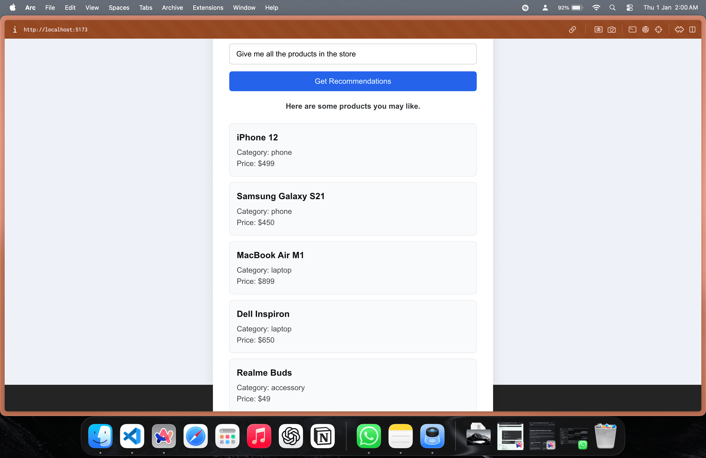

# 🧠 AI Product Recommendation System

An intelligent product recommendation system that understands natural language queries and suggests relevant products. Built with FastAPI, LangChain, OpenAI, and React.

## ✨ Features

- **Natural Language Processing**: Ask questions like "I want a phone under $500" in plain English
- **Smart Recommendations**: AI-powered matching that understands context and user intent
- **Modern Stack**: Fast, responsive interface with real-time results
- **Easy to Extend**: Simple product dataset structure for quick customization

## 📸 Screenshots

### Product Recommendations Based on Budget

*Example: Finding phones under $500*

### Precise Price Filtering

*Example: Products under $460*

### Browse All Products

*Example: View entire product catalog*

### Category-Based Search

*Example: Finding accessories like earbuds*

## 🛠️ Tech Stack

### Frontend
- **React** with Vite for fast development
- **JavaScript** & **CSS** for interactivity and styling

### Backend
- **Python** with **FastAPI** for high-performance APIs
- **LangChain** for AI orchestration
- **OpenAI API** for natural language understanding

## 📁 Project Structure
```
project/
├── backend/
│   ├── main.py              # FastAPI application entry point
│   ├── ai_service.py        # AI logic and LangChain integration
│   ├── products.py          # Product dataset
│   ├── schemas.py           # Pydantic models for requests/responses
│   ├── config.py            # Environment and configuration
│   ├── requirements.txt     # Python dependencies
│   └── .env                 # Environment variables (create this)
│
├── frontend/
│   ├── src/
│   │   ├── App.jsx          # Main React component
│   │   ├── api.js           # API integration layer
│   │   ├── App.css          # Styling
│   │   └── main.jsx         # React entry point
│   ├── index.html
│   └── package.json
│
└── screenshots/             # Application screenshots
    ├── screenshot1.png
    ├── screenshot2.png
    ├── screenshot3.png
    └── screenshot4.png
```

## 🚀 Getting Started

### Prerequisites

- **Python 3.8+** installed
- **Node.js 16+** and npm installed
- **OpenAI API key** ([Get one here](https://platform.openai.com/api-keys))

### Backend Setup

1. **Navigate to the backend directory**
```bash
   cd backend
```

2. **Install Python dependencies**
```bash
   pip install -r requirements.txt
```

3. **Configure environment variables**
   
   Create a `.env` file in the `backend/` directory:
```env
   OPENAI_API_KEY=your_openai_api_key_here
```

4. **Start the backend server**
```bash
   uvicorn main:app --reload
```

   The backend will be available at:
   - **API**: http://localhost:8000
   - **Interactive Docs**: http://localhost:8000/docs

### Frontend Setup

1. **Navigate to the frontend directory**
```bash
   cd frontend
```

2. **Install dependencies**
```bash
   npm install
```

3. **Start the development server**
```bash
   npm run dev
```

   The frontend will be available at: **http://localhost:5173**

## 🔄 How It Works

1. **User Input**: Enter a natural language query (e.g., "Show me laptops under $1000 with good battery life")
2. **API Request**: Frontend sends the query to the FastAPI backend
3. **AI Processing**: LangChain orchestrates OpenAI to parse and understand the request
4. **Product Matching**: The AI analyzes the product dataset and finds relevant matches
5. **Response**: Recommendations are returned and displayed in an intuitive interface

## 🎯 Example Queries

Try these queries to see the system in action:

- "I need a budget phone under $500"
- "Show me high-end laptops for gaming"
- "Recommend wireless headphones with noise cancellation"
- "What tablets are good for students?"
- "Give me all the products in the store"
- "Show me some good ear buds"

## 🔧 Customization

### Adding Products

Edit `backend/products.py` to add or modify products in the dataset. Each product should include relevant attributes like name, price, category, and features.

### Adjusting AI Behavior

Modify the prompts and logic in `backend/ai_service.py` to customize how the AI interprets queries and selects products.

